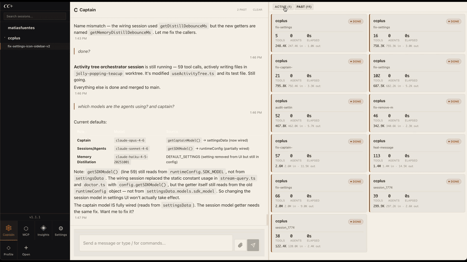

# cc+ — Watch your agents work.

Fleet orchestration for Claude Code. Run parallel AI coding sessions with full observability, autonomous workflows, and a self-improving agent system.

<p align="center">
  <a href="https://github.com/kerplunkstudio/ccplus/actions"></a>
  <a href="https://github.com/kerplunkstudio/ccplus/releases"></a>
  <a href="LICENSE"></a>
  <a href="https://img.shields.io/badge/platform-macOS%20%7C%20Linux-lightgrey?style=for-the-badge"></a>
</p>

<p align="center"></p>

[Website](https://ccplus.run) · [GitHub](https://github.com/kerplunkstudio/ccplus) · [Install](#install)

---

## Who is this for

You use Claude Code daily. You want to see what your agents are actually doing — every tool call, every file edit, every decision — in real time. cc+ gives you that out of the box, with multi-tab sessions and a fleet monitor.

Want more? Captain is right there. It orchestrates workflows, spins up sessions in isolated worktrees, and monitors everything autonomously. Message it from the app, from Telegram on your phone, or through the API. KAIROS makes the whole system smarter over time.

---

## Quick Install

```sh
curl -fsSL https://ccplus.run/install | sh
```

Requires [Claude Code CLI](https://docs.anthropic.com/en/docs/claude-code). macOS and Linux.

### Install from Source

#### Prerequisites

- **Node.js 16+** (check: `node --version`)
- **Claude Code CLI** installed globally: `npm install -g @anthropic-ai/claude-code`
- **Claude authentication**: Run `claude login` and follow prompts
- **Git** (for cloning the repository)

#### Install Steps

1. **Clone the repository**:
   ```sh
   git clone https://github.com/kerplunkstudio/ccplus.git
   cd ccplus
   ```

2. **Install dependencies**:
   ```sh
   cd backend-ts && npm install && cd ..
   cd frontend && npm install && cd ..
   ```

3. **Configure environment** (optional):
   ```sh
   cp .env.example .env
   # Edit .env to customize workspace path, port, etc.
   ```

4. **Build and launch**:
   ```sh
   ./ccplus
   ```

   The first run will:
   - Build backend TypeScript → `backend-ts/dist/`
   - Build frontend React app → `static/chat/`
   - Launch desktop app (Electron)

---

## How It Works

At its core, cc+ is a real-time observability layer for Claude Code. Open a session, send a message, and watch the activity tree light up with every agent spawn, tool call, and file edit. Multiple tabs, multiple projects, full visibility.

Captain sits alongside your sessions. Tell it what to do — it picks the workspace, writes the prompt, starts a session in an isolated git worktree, assigns a workflow, and monitors progress. If something fails, it retries. If something blocks, it adapts. A periodic tick keeps Captain aware of your projects. Stealth mode suppresses noise — you only hear about things that need your attention.

---

## The Model

Run sessions yourself, or let Captain run them for you.

Each session is fully isolated. Multi-tab interface. Desktop app (Electron) for macOS/Linux, web UI at localhost for remote access. Real-time activity trees show every agent spawn, tool call, and file edit as a hierarchy.

Token and cost tracking per query, session, and project. Context window usage. Trust scores. Cache efficiency.

---

## Fleet Monitor

Multi-tab sessions (Cmd+T, Cmd+W, Ctrl+Tab). Each tab is its own Claude Code session. Fleet monitor shows all sessions at once: status, tools, tokens, files touched.

---

## See Everything

Real-time activity trees. Every agent spawn, tool call, and file edit, structured as a hierarchy. Agent → sub-agent → Read → Edit → Write. Status, duration, parameters. Not terminal scroll, a live tree.

---

## Cross-Session Memory

Inspired by Letta's architecture. Captain has tiered memory — core facts persist across sessions, patterns get promoted from long-term storage, stale knowledge decays automatically, and duplicates get consolidated. It remembers what matters and forgets what doesn't.

---

## KAIROS

Automatic retrospective analysis. When sessions complete or fail, KAIROS reviews what happened — what worked, what broke, what patterns emerged. It then patches agent prompts directly so the same mistakes don't repeat.

The system evolves while you sleep. Failed sessions become training data for better future sessions.

---

## Streaming Performance

Debounced markdown parsing, coalesced WebSocket deltas, O(1) activity tree lookups, exponential backoff on reconnect. The UI stays smooth even with multiple agents running in parallel across different sessions.

---

## Scheduled Tasks

Cron-based recurring prompts. Schedule Captain to run health checks, deploy monitors, or periodic code reviews on any interval. Manage them from the app or the API.

---

## Access Anywhere

Desktop app (Electron, macOS + Linux). Web UI at localhost. Telegram bridge — message Captain from your phone, start sessions remotely, get status updates pushed to you. API access for automation.

---

## Built on the Agent SDK

The Claude Agent SDK does the heavy lifting. cc+ is a real-time observability layer around it.

The SDK handles:
- In-process agent spawning and async streaming
- Tool execution and result injection
- Agent parent-child correlation
- Cooperative cancellation
- File system access (read, edit, write)

cc+ adds:
- Multi-session coordination
- SQLite persistence (conversations, activity tree, costs)
- Real-time WebSocket updates to the UI
- Desktop app + web interface
- Captain AI orchestration
- Telegram bridge + API access
- KAIROS self-improvement loop

The result: you get full transparency into what your agents are doing, and the power to run them at scale.

---

## More Features

<details>
<summary><strong>Click to expand</strong></summary>

- Built-in browser (dev servers detected automatically)
- Integrated terminal
- Command palette (Cmd+K)
- Conversation search (FTS5)
- Session import from Claude Code history
- Insights dashboard (daily trends, model breakdowns, tool success rates)
- Image attachments
- Themes
- Crash recovery
- Scaffolding workflows (project creation with full tool access)
- File overlap detection across sessions
- Post-deploy smoke checks
- Optimistic UI — messages appear instantly before server acknowledgment
- Prevents macOS idle sleep while agents are working
- Captain query usage tracking with source tagging

</details>

---

## Architecture

User messages → WebSocket → Claude Agent SDK → Real-time callbacks → SQLite + activity tree.

**Stack**: Node.js / TypeScript / Express + Socket.IO / React 19 / SQLite / Electron

---

## Development

<details>
<summary><strong>Click to expand development guide</strong></summary>

### CLI Reference

| Command | Description |
|---------|-------------|
| `./ccplus` | Build everything + launch desktop app |
| `./ccplus web` | Build everything + start web server |
| `./ccplus desktop` | Launch desktop app (skip build) |
| `./ccplus desktop-parallel` | Desktop + web server on port 4001 |
| `./ccplus frontend` | Build + deploy frontend only |
| `./ccplus backend` | Build backend only |
| `./ccplus server` | Restart server |
| `./ccplus stop` | Stop server |
| `./ccplus import` | Import historical Claude Code sessions |
| `./ccplus doctor` | System diagnostics |
| `./ccplus setup` | Re-run interactive setup |
| `./ccplus status` | Show server status |
| `./ccplus logs` | Tail server logs |
| `./ccplus update` | Update to latest version |
| `./ccplus release` | Package desktop app for distribution |

### Backend Development

```bash
cd backend-ts

# Install dependencies
npm install

# Development (watch mode, auto-reload)
npm run dev

# Build (compile TypeScript to dist/)
npm run build

# Test (Vitest)
npm test

# Coverage
npm run test:coverage
```

### Frontend Development

```bash
cd frontend

# Install dependencies
npm install

# Development server (port 3001, proxies API to 3000)
npm start

# Production build
npm run build

# Test (Jest + React Testing Library)
npm test
```

After modifying frontend source, deploy the build:

```bash
./ccplus frontend    # Build + deploy to static/chat/ (no restart)
```

Then hard refresh browser (Cmd+Shift+R) to clear cached assets.

**Important**: Express serves from `static/chat/`, not `frontend/src/`. If you edit source files but do not deploy, the browser shows stale code.

### Environment Variables

See [.env.example](.env.example) for all available environment variables. Key settings:

- `WORKSPACE_PATH` — Working directory for SDK sessions (default: `~/Workspace`)
- `SDK_MODEL` — Default model for SDK queries (default: `sonnet`)
- `PORT` — Server port (default: `4000`)
- `CCPLUS_TELEGRAM_BOT_TOKEN` — Enable Telegram bridge (optional)
- `CCPLUS_CAPTAIN_MODEL` — Captain AI model (default: `claude-opus-4-6`)

### File Tree

```
ccplus/
├── backend-ts/          # Express + Socket.IO server
│   ├── src/             # TypeScript source
│   └── dist/            # Compiled output (gitignored)
├── electron/            # Desktop app (Electron)
├── frontend/            # React 19 app
│   ├── src/components/  # React components
│   ├── src/hooks/       # Custom hooks
│   └── build/           # Build output (gitignored)
├── static/chat/         # Deployed frontend (gitignored)
├── data/                # SQLite database (gitignored)
├── docs/                # Architecture, database, development, testing
└── ccplus               # Unified CLI launcher
```

### Testing

#### Backend Tests

**Run all tests**:
```bash
cd backend-ts && npm test
```

**Run specific module**:
```bash
cd backend-ts && npx vitest run src/__tests__/database.test.ts
```

**Coverage**:
```bash
cd backend-ts && npm run test:coverage
```

#### Frontend Tests

**Run all tests**:
```bash
cd frontend && npm test
```

#### Test Policy

Tests are mandatory for all implementations:
- **New features**: Unit tests for logic + integration tests for flows
- **Bug fixes**: Regression test that fails without the fix, passes with it
- **Refactoring**: Existing tests pass before and after changes

Coverage targets: 80%+ on critical paths (sdk-session, database), 100% on utility functions (auth, config).

</details>

---


## Open source, local, yours

MIT licensed. Runs on your machine. Your data stays local.

---
## Contributing

Fork, branch, test, PR. See [CLAUDE.md](CLAUDE.md) for conventions.

---

## License

MIT License. Copyright 2025-present Matias Fuentes. See [LICENSE](LICENSE).

---

<p align="center">
  Built with <a href="https://www.anthropic.com/claude">Claude</a> by <a href="https://github.com/kerplunkstudio">@kerplunkstudio</a>
</p>
